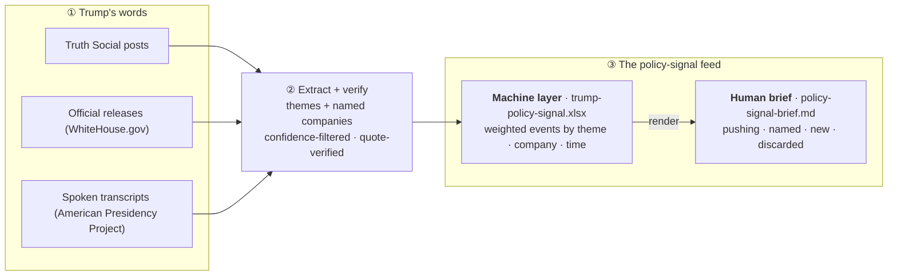

# Trump Policy-Signal

A **deterministic feed that turns Trump's communications into a weighted, thesis-linked _attention_ signal** — an input to an AI-investing research process.

> ⚠️ **NOT a trade signal. NOT investment advice. NOT predicted return.** This measures *attention* — how official a channel, how specific a target, how market-material a topic — and surfaces named companies with a **verified literal quote**. It never claims causation or forecasts price.

---

## What it does



Three source families → a hybrid extractor (theme regex + a curated company gazetteer) → weighted, deduped, confidence-filtered events → rolled up by **theme / company / time** → two outputs:

- **Machine layer** — `v2/output/trump-policy-signal.xlsx` (7 tabs: `events`, `entity_rollup`, `theme_rollup`, `timeline`, `market_context`, `source_weights`, `discards`).
- **Human brief** — `v2/output/policy-signal-brief.md` (weekly read: *new this week* · *themes pushed* · *companies named* · *discarded/audit*).

## Design principles

- **Deterministic-first.** Ingest → classify → weight → roll up → render is all plain code. An optional Haiku refinement is a *cached* enrichment only (used iff `ANTHROPIC_API_KEY` is set); the hot path needs no model.
- **Quote-verified, no hallucination.** Every surfaced company carries a quote that is a **literal substring** of the source doc, and a ticker that **resolves in the gazetteer**. Otherwise it is dropped.
- **No silent cuts.** Every discarded mention is logged with a reason (see the `discards` tab and the brief's audit section).
- **Curated universe.** Matching runs against a **~200-name investable universe** (semiconductors + software heavy, with energy / finance / defense / pharma / crypto adjacents), not all ~10k US tickers — this removes microcap and common-word noise. A small media/political **blocklist** drops attack-targets (e.g. "Failing New York Times").

## Weighting

`impact_weight = channel × specificity × materiality`

| Dimension | Scale |
|---|---|
| **channel** | exec_action 1.0 · oval_remark 0.9 · official_release 0.8 · speech 0.7 · social_post 0.5 · social_praise 0.2 · social_repost 0.15 (deleted ×0.5) |
| **specificity** | named company 1.0 · product/person 0.8 · sector 0.6 · macro 0.3 |
| **materiality** | tradeable theme (tariffs/Fed/semis/energy/defense/pharma/crypto) 1.0 · manufacturing 0.6 · non-market 0.1 |

Rollups add a **decay-weighted** standing score and **week-over-week momentum**.

## Layout

```
v2/scripts/
  generate_policy_signal.py   orchestrator: load → extract → weight → roll up → render
  extractor.py                hybrid theme + open-vocab company extractor (+ blocklist)
  resolver.py                 gazetteer name→ticker matcher (greedy, context-gated)
  transcripts.py              APP + WhiteHouse spoken/official ingestion (parses bodies)
  fetch_transcripts.py        live fetch of 2nd-term APP transcript document BODIES
  build_universe.py           builds the curated ~200-name gazetteer + attack blocklist
  gazetteer.json              the curated matching universe
  attack_blocklist.json       media / political attack-target drops
  ambiguity_blocklist.json    common-word gating (Apple/Texas/Arm need context)
  common_word_gate.json       frozen common-English-word gate
v2/output/
  policy-signal-brief.md      the human brief
  trump-policy-signal.xlsx    the machine layer (7 tabs)
  policy-signal-dataflow.html the data-path diagram (rendered)
output/
  posts_all.csv               Truth Social corpus (input)
  market_prices.csv           price bars (input)
```

## Run

```bash
cd v2/scripts
python3 build_universe.py        # build the curated universe + blocklist (idempotent)
python3 fetch_transcripts.py     # live: fetch 2nd-term APP transcript bodies into cache/
cd ..
python3 scripts/generate_policy_signal.py            # full (allows live WH/APP/Nasdaq fetch, cached)
python3 scripts/generate_policy_signal.py --no-fetch # offline: cache + gazetteer only
```

Requires `pandas`, `numpy`, `requests`, `beautifulsoup4`, `openpyxl`. The `cache/` is gitignored and regenerable.

## Honest caveats

- **This is an evidence feed, not alpha.** An earlier v1 event-study (testing post → price reaction) found no tradeable signal after multiple-testing correction and beta-adjustment, and a post-only pipeline structurally misses spoken catalysts. v2 reframes the goal: *interpretation and persistence of attention*, fed into a human research process — explicitly **not** a latency/trading signal.
- **Transcript coverage.** Spoken remarks come from the American Presidency Project's Trump 2nd-term archive; coverage reflects what that source has published. Transcripts enrich the all-time company/theme rollups; only remarks dated within the brief's window appear in *new this week*.
- **To edit the universe or blocklist:** change the `CURATED` / `BLOCKLIST` dicts in `build_universe.py` and re-run it.

_Attention weight is never presented as predicted return or causation._
